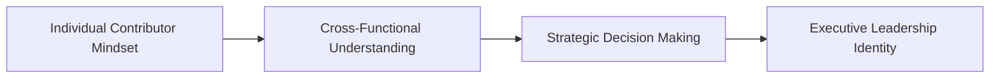
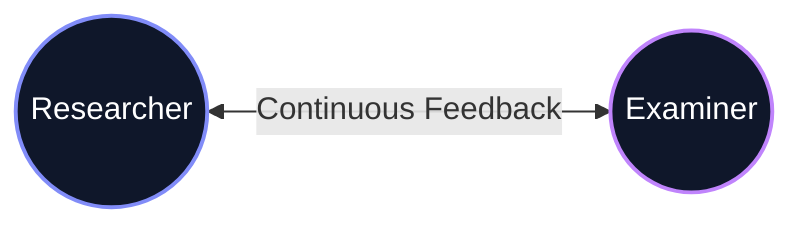

# MBA Semester 1: Professional Orientation

Welcome to your MBA. An MBA is not just an extension of your undergraduate studies; it is a fundamental shift in your professional identity. 

You are no longer just an individual contributor learning theories. You are training to be a leader, a strategist, and a decision-maker in the corporate world.

---

## 1. The Executive Mindset

The transition from a student to an executive requires a shift in how you approach problems:
*   **From "What" to "Why":** Undergraduates ask *what* the formula is. MBAs ask *why* we are using this formula to solve this specific business problem.
*   **From Silos to Systems:** You must stop seeing Marketing, Finance, and HR as separate subjects. In the real world, a marketing campaign (Marketing) requires a budget (Finance) and personnel (HR).

### The MBA Transformation

---

## 2. Defining Your Professional Baseline

Before you can lead a company, you must know where you stand today. Your "Professional Baseline" is an honest assessment of your current business acumen, communication skills, and leadership potential.

**Key Questions to Ask Yourself:**
*   What is my current level of financial literacy?
*   How effectively do I handle conflict and ambiguity?
*   Do people naturally listen when I speak?

---

## Activity: The Baseline Reflection

Complete your professional baseline reflection. This will serve as the foundation for your growth over the next two years.

<!-- PRINT: PG_ProfBaseline -->

---

## Executive Interpersonal Skills: The Transactional Model in Academia
As a postgraduate, your understanding of communication must transcend basic transmission. 

Based on *Systems Theory*, every element in a seminar or thesis defense interconnectedly impacts the other. A change in your micro-expression alters the examiner's decoding in real-time, which instantly alters their subsequent questions.

<!-- PRINT_SLIDE -->

