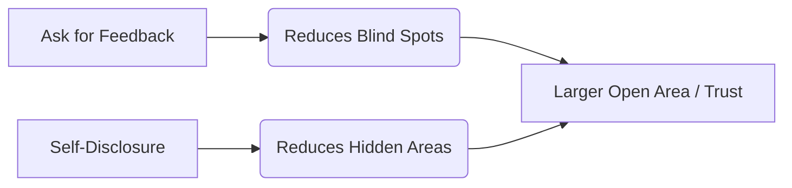

# MBA Semester 1: Advanced Self-Awareness

Great leaders are deeply self-aware. They know their strengths, they acknowledge their weaknesses, and they surround themselves with people who compensate for their blind spots.

---

## 1. The Johari Window in Leadership

The Johari Window is a psychological tool used to improve self-awareness and mutual understanding between individuals within a group.

*   **Open Area:** What you know about yourself and others know about you (e.g., your public speaking skills).
*   **Blind Spot:** What others see in you, but you do not see in yourself (e.g., a tendency to interrupt people in meetings).
*   **Hidden Area:** What you know about yourself, but keep hidden from others (e.g., imposter syndrome).
*   **Unknown:** Traits hidden from both you and others.

### Expanding the Open Area

---

## 2. Identifying Growth Gaps

A "Growth Gap" is the distance between your current competency and the competency required for your target post-MBA role.

*   If you are targeting Investment Banking, a gap in financial modeling is a critical flaw.
*   If you are targeting HR Consulting, a gap in empathy or conflict resolution is a critical flaw.

---

## Activity: The Competency Profile

Map out your strengths and your critical growth gaps required for your target industry.

<!-- PRINT: PG_CompetencyProfile -->

---

## Executive Interpersonal Skills: Communibiological vs. Social Learning

*   **Communibiological Approach**: Suggests that communication behaviors (like public speaking anxiety) are heavily genetically inherited.
*   **Social Learning Theory**: Counters this by proving that regardless of genetic disposition, students can adapt, observe, and learn to modify their behaviors.
*   *The Postgraduate Takeaway*: You cannot blame "biology" for poor presentation skills. Competence is a learned, practiced discipline.

<!-- PRINT_SLIDE -->

