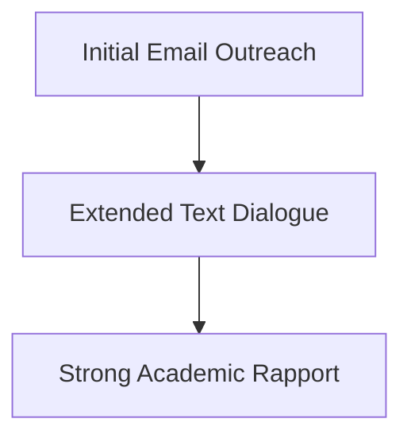

# MBA Semester 1: Self-Management & Accountability

An MBA program is inherently stressful, designed to simulate the pressures of the corporate world. Your ability to manage your time, energy, and accountability is the primary predictor of your success.

---

## 1. Time vs. Energy Management

Time management is about scheduling your 24 hours. Energy management is about optimizing the quality of those hours.

*   **Time Management:** Using calendars, block-scheduling, and the Eisenhower Matrix (Urgent vs. Important).
*   **Energy Management:** Recognizing when you are most productive (morning vs. night) and protecting that time for deep, strategic thinking.

### The Accountability Loop

---

## 2. Extreme Ownership

In the corporate world, excuses do not matter; results do. The concept of "Extreme Ownership" means taking absolute responsibility for everything that impacts your mission.

If your team fails a project because a teammate missed a deadline, an undergraduate blames the teammate. An MBA asks, "Why didn't I check in with them earlier? How could I have supported them?"

---

## Activity: Performance Management Plan

Draft your personal performance management plan for this semester.

<!-- PRINT: PG_PerfManagement -->

---

## Executive Interpersonal Skills: Social Information Processing
While early theories believed electronic communication was too "lean" for building strong academic networks, modern research proves otherwise.

*   **Social Information Processing**: We *can* communicate intellectual depth and build rapport online with researchers and industry leaders, it just takes longer without nonverbal cues.

<!-- PRINT_SLIDE -->

