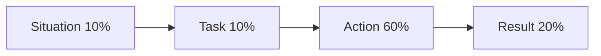

# MBA Semester 2: Interview Design & Response

In your first year, you learned how to answer interview questions. Now, as an MBA, you must learn how to *design* interviews and respond to high-level behavioral probing.

---

## 1. The Behavioral Interview (STAR Method)

Top firms (Amazon, Google, MBB) use behavioral interviewing because past behavior predicts future behavior. 
You must structure every answer using the STAR method:
*   **S - Situation:** Set the scene (briefly).
*   **T - Task:** What was your specific responsibility?
*   **A - Action:** What steps did *you* take? (Use "I", not "We").
*   **R - Result:** What was the quantifiable outcome?

### The STAR Flow

---

## 2. Designing the Interview

Soon, you will be the one conducting the interviews. 
How do you design a question to test for "resilience" without asking "Are you resilient?" (to which everyone says yes).
You ask: "Tell me about a time you worked on a project for months, and it was suddenly canceled by leadership."

---

## Activity: Mock Response Lab

Participate in a rapid-fire STAR-style behavioral interview lab, acting as both the interviewer and the candidate.

<!-- PRINT: PG_InterviewDesign -->

---

## Executive Interpersonal Skills: Navigating Virtual Workspaces

*   **Shared Workspaces**: Digital environments that break geographical boundaries, allowing simultaneous thesis editing and networking with global peers. 
As a postgraduate, you must foster an inclusive culture inside these digital walls to build a powerful alumni network.

<!-- PRINT_SLIDE -->

