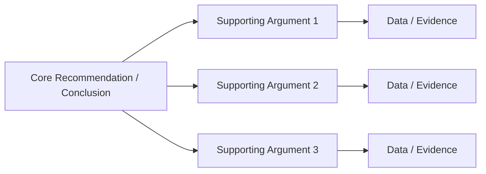

# MBA Semester 2: Analytical Articulation

An executive does not just speak; an executive *articulates*. Analytical articulation is the ability to take complex, multifaceted data and distill it into a clear, logical, and persuasive narrative.

---

## 1. The Pyramid Principle

Consulting firms like McKinsey use the Pyramid Principle to structure their communication. 
Instead of building up to a conclusion (like a mystery novel), you start with the conclusion, followed by the supporting arguments, and finally the granular data.

### The Pyramid Structure

---

## 2. Speaking with Evidence

Never make an assertion without data to back it up. 
*   **Weak:** "We should expand into the Asian market; it looks promising."
*   **Strong:** "We must prioritize the Asian market this quarter. The data shows a 24% YoY growth in our sector there, while our domestic market has stagnated at 2%."

---

## Activity: The Concept Explanation

Take a complex financial or operational concept and explain it clearly and logically to a non-expert audience using the Pyramid Principle.

<!-- PRINT: PG_ConceptExplain -->

---

## Executive Interpersonal Skills: Overcoming Resistance to Ideas

When proposing a new thesis methodology or challenging established ideas in a seminar, resistance is logical. 
Do not accuse or bulldoze. Use *empathic listening* to bring their critiques into the open ("I understand this approach seems unconventional..."). Acknowledge objections fairly to lower defenses and build academic alliances.

<!-- PRINT_SLIDE -->

