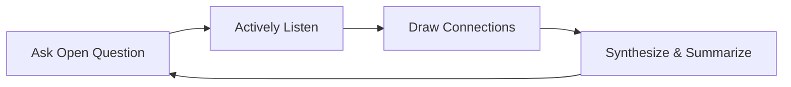
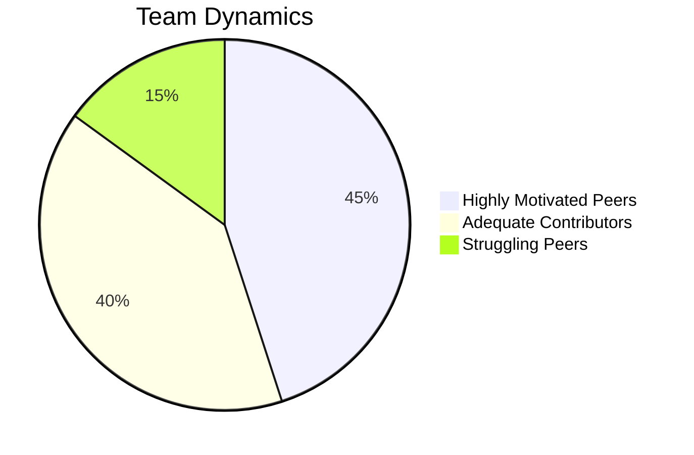

# MBA Semester 2: Discussion Facilitation

A leader's job is not always to have the best idea; it is often to extract the best ideas from the room. Discussion facilitation is the art of guiding a group of intelligent (and often opinionated) people toward a consensus or decision.

---

## 1. The Role of the Facilitator

A facilitator is a neutral guide. Your goal is the *process*, not the *content*.
*   **Keep it on track:** When a VP goes on a tangent, you gently bring the focus back to the agenda.
*   **Ensure equal voice:** You must actively pull introverts into the conversation and politely manage dominators.
*   **Synthesize:** Periodically summarize what has been agreed upon and what is still outstanding.

### The Facilitation Loop

---

## 2. Managing Conflict in the Room

When two executives strongly disagree, the facilitator must depersonalize the conflict. 
Shift the focus from "Who is right?" to "What does the data say?" or "Which option best serves our strategic goal?"

---

## Activity: The Facilitated Group Round

Act as the neutral facilitator for a complex, 15-minute business case discussion.

<!-- PRINT: PG_Facilitation -->

---

## Executive Interpersonal Skills: Evaluating Collaborative Styles

Future leaders must learn to tailor their approach to different peers during PG projects:
*   **Highly Motivated Peers**: Need frequent, subtle brainstorming sessions to maintain high growth without feeling micromanaged.
*   **Adequate Contributors**: Need clear role definition; they are reliable when given specific tasks.
*   **Struggling Peers**: Need highly frequent, specific guidance tied directly to the project's milestones.

<!-- PRINT_SLIDE -->

