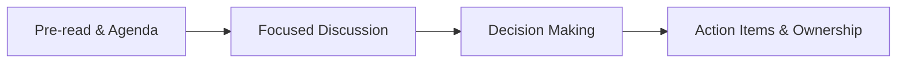

# MBA Semester 2: Meetings & Leadership

Executives spend up to 50% of their working lives in meetings. A poorly run meeting destroys morale and wastes thousands of dollars in billable hours. A well-run meeting is a force multiplier.

---

## 1. The Rules of Engagement

Never call a meeting if an email will suffice. If a meeting is necessary, adhere to strict discipline:
*   **The Agenda:** A meeting without an agenda is a hostage situation. Send the agenda 24 hours in advance.
*   **The Clock:** Start on time. End on time. If the CEO is 5 minutes late, you start anyway.
*   **The Output:** Every agenda item must end with an Action Item (Who is doing what, by when?).

### Meeting Lifecycle

---

## 2. Chairing the Meeting

As the chair, you are the conductor. You are responsible for the energy and the outcome.
*   Park off-topic issues in a "Parking Lot" to be discussed later.
*   Interrupt politely but firmly if the conversation loops.
*   Always end with a recap of decisions made.

---

## Activity: Mock Meeting Leadership

Chair a 10-minute mock meeting with a disruptive participant and a tight agenda.

<!-- PRINT: PG_MeetingLeadership -->

---

## Executive Interpersonal Skills: Enterprise Wikis

*   **Knowledge Bases**: Fluid, community-driven hubs (like Notion or shared wikis) for internal research accumulation. 
They democratize information within your cohort but require strict organization to prevent data loss or plagiarism.

<!-- PRINT_SLIDE -->

