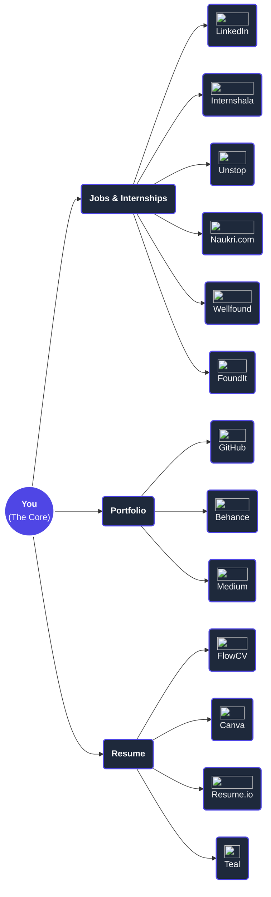

# 🎓&#xFE0F; The Success Toolkit
## Skills for Life & Career

Welcome to the **M.Com Orientation Programme**! 

*You've upgraded your degree, but have you upgraded your toolkit?*
A Master's degree gets you the interview; your **toolkit** gets you the job and the promotions.

---

# 🧊&#xFE0F; The "Reputation" Test
### Icebreaker Activity

Jeff Bezos famously said: *"Your brand is what people say about you when you leave the room."*

Imagine you are applying for a job tomorrow. The HR Manager calls your **college friends** and asks:
*"Tell me the honest truth about them in 3 words."*

**What would your friends say?**

*(Take 60 seconds to think about your current reputation!)*

---

# 🏢&#xFE0F; The 3 Pillars of Career Success
## What the Corporate World Actually Wants

1. **Communication Beyond the Syllabus:** Articulation and active listening.
2. **Adaptability & Problem Solving:** The "figure-it-out" factor.
3. **The Digital Footprint:** Your online professional presence.

---

# 📝&#xFE0F; Pillar 1: Communication
## Frameworks: PREP & STAR

Don't just talk; structure your thoughts.

| PREP (Expressing Opinions) | STAR (Interview Questions) |
| :--- | :--- |
| **Point:** State your main point. | **Situation:** Set the scene. |
| **Reason:** Why do you believe this? | **Task:** What was the challenge? |
| **Example:** Give a concrete example. | **Action:** What did *you* specifically do? |
| **Point:** Reiterate your main point. | **Result:** What was the outcome? |

---

# ✉️&#xFE0F; Pillar 1: Communication
## The Email Rule

It is not just about speaking fluent English. 
It is about clarity, structuring your thoughts, and knowing your audience.

*Can you write a concise, professional email that gets a CEO to reply in 5 seconds?*
- Clear subject line.
- Get straight to the point.
- Clear Call-to-Action (CTA).

---

# 🧠&#xFE0F; Pillar 2: Adaptability
## The "Figure-It-Out" Factor

The corporate world does not have "out of syllabus" questions.

Employers don't want people who just follow instructions; they want people who **solve problems when instructions are missing.**

---

# 🧩&#xFE0F; Pillar 2: Adaptability
## What is Problem Solving?

Problem solving isn't about knowing the exact answer immediately.

It is the ability to:
1. Break down a massive, complex issue into smaller parts.
2. Make logical assumptions when data is missing.
3. Arrive at a reasonable, actionable conclusion.

---

# 🔢&#xFE0F; Pillar 2: Adaptability
## Guesstimation Basics

**Guesstimation** = Guessing + Estimation

It is a common interview technique used by top companies to test your analytical thinking, logic, and how you handle ambiguity under pressure.

They don't care about the final number. **They care about your approach.**

---

# 🤔&#xFE0F; Pillar 2: Adaptability
## Guesstimation Examples

How would you solve these?

1. **How many tennis balls can be filled in this room?**
2. **How many cars are stuck in traffic at Kyatsandra toll/junction at 10:00 AM on a Monday?**

*There is no Google search for this. You have to figure it out!*

---

# 🛠️&#xFE0F; Pillar 2: Adaptability
## How to Approach Guesstimates

**Step 1: Clarify the Question** 
*(Is it a standard tennis ball? Is the room empty?)*

**Step 2: Break it Down (The Equation)**
*(Volume of room ÷ Volume of one tennis ball)*

**Step 3: Make Reasonable Assumptions**
*(Assume room is 20ft x 20ft x 10ft. Assume Kyatsandra sees 500 cars per hour on NH48...)*

**Step 4: Do the Math & Sanity Check**
*(Does the final number make logical sense?)*

---

# 🌐&#xFE0F; Pillar 3: The Digital Footprint
## Catching Up With the Trend

Think about how we all started...
Years ago, we all rushed to create **Facebook** accounts.
Then we moved to **Instagram**, caught up with **Snapchat**, and learned the trends.

We are naturally good at adapting to social trends and becoming a part of the community!

---

# 💼&#xFE0F; Pillar 3: The Digital Footprint
## The Professional Front

Just like we adapt to social media, we must adapt to **professional media**.

There are platforms out there specifically designed to help you:
- Land a full-time job.
- Secure freelance projects.
- Get interviews.
- Book appointments with industry professionals.

---

# 🌳&#xFE0F; Pillar 3: The Digital Footprint
## The Tree of Professional Opportunity

---

# 🗣️&#xFE0F; Activity: The Elevator Pitch
## Sell Your Skills, Not Your Grades

**Scenario:** You are stuck in an elevator with the hiring manager of a top firm. You have 30 seconds.

**Your Task:** Pitch *why* your background makes you valuable, **without mentioning your grades**. Focus on skills (analytical thinking, teamwork, data handling).

*(Find a partner. You have 3 minutes to prepare, and 2 minutes to pitch!)*

---

# 🎙️&#xFE0F; The Elevator Pitch
## A Sample Pitch

*"Hi, I'm [Name], an M.Com student specializing in Finance. Recently, I analyzed the financial health of 5 local businesses for a project, identifying a 15% cost-saving opportunity for one of them.* 

*I know how to turn raw numbers into actionable business strategies. I see your firm is expanding its SME advisory wing, and my hands-on data analysis skills would make me a great fit for your team."*

---

# ❓&#xFE0F; Open Floor
## Q&A Session

What is the one skill you feel you need to start working on today?

Don't hesitate to ask questions—curiosity is the first step to growth!

---

# 🚀&#xFE0F; The 30-Day Challenge
## Don't Let The Motivation Die

Your homework for the next month:

1. **Task 1:** Create or update your LinkedIn profile by tonight.
2. **Task 2:** Speak up at least once in every class this week to build public speaking confidence.

---

# 🏁&#xFE0F; Final Thought

*"Your M.Com degree is your ticket to the game, but your skills dictate how you play it."*

**Start building your toolkit today.**

Connect with us and let's begin this journey of growth, learning, and leadership together!
