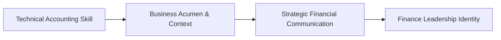
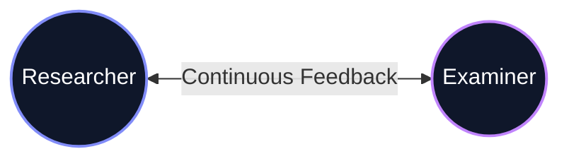

# M.Com Semester 1: Professional Orientation in Finance

Welcome to the Master of Commerce. Your undergraduate degree taught you how to record financial transactions. Your master's degree will teach you how to interpret them, communicate them to stakeholders, and use them to drive corporate strategy.

---

## 1. The Financial Communicator

The biggest mistake finance professionals make is assuming everyone else understands finance. You must translate complex ledgers and tax codes into a language that a marketing director or a CEO can understand.

*   **From Bookkeeper to Strategist:** You are no longer just balancing the books. You are advising the business on risk and opportunity.
*   **The Stakeholder Lens:** How does this regulatory change affect our supply chain? How do we explain this margin drop to investors?

### The M.Com Transformation

---

## 2. Defining Your Professional Baseline

Assess your current capabilities. Are you purely technical, or can you lead a conversation about financial strategy?

**Key Questions:**
*   Can I explain a complex tax concept to a non-expert in 2 minutes?
*   How comfortable am I presenting financial data to a large room?

---

## Activity: The Baseline Reflection

Complete your professional baseline reflection, focusing on your financial communication gaps.

<!-- PRINT: PG_ProfBaseline -->

---

## Executive Interpersonal Skills: The Transactional Model in Academia
As a postgraduate, your understanding of communication must transcend basic transmission. 

Based on *Systems Theory*, every element in a seminar or thesis defense interconnectedly impacts the other. A change in your micro-expression alters the examiner's decoding in real-time, which instantly alters their subsequent questions.

<!-- PRINT_SLIDE -->

