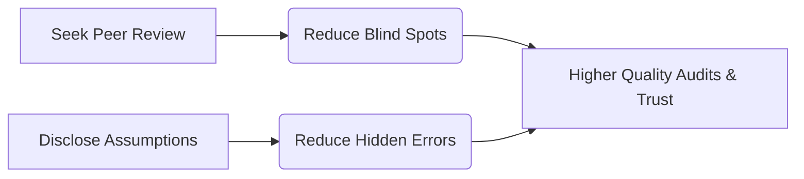

# M.Com Semester 1: Advanced Self-Awareness

In finance, overconfidence can lead to catastrophic risk. Deep self-awareness and an understanding of your own biases are critical for anyone managing capital or audits.

---

## 1. Cognitive Biases in Finance

You must recognize how your own mind might deceive you when analyzing data:
*   **Confirmation Bias:** Looking only for data that supports your initial financial model.
*   **Anchoring:** Relying too heavily on the first piece of information offered (e.g., in a salary negotiation or a valuation).

### The Johari Window in Teamwork

---

## 2. Identifying Growth Gaps

What separates an accountant from a CFO? The growth gap usually involves soft skills: negotiation, empathy, public speaking, and crisis management. 

---

## Activity: The Competency Profile

Map out your strengths and the critical growth gaps required for a leadership role in finance or academia.

<!-- PRINT: PG_CompetencyProfile -->

---

## Executive Interpersonal Skills: Communibiological vs. Social Learning

*   **Communibiological Approach**: Suggests that communication behaviors (like public speaking anxiety) are heavily genetically inherited.
*   **Social Learning Theory**: Counters this by proving that regardless of genetic disposition, students can adapt, observe, and learn to modify their behaviors.
*   *The Postgraduate Takeaway*: You cannot blame "biology" for poor presentation skills. Competence is a learned, practiced discipline.

<!-- PRINT_SLIDE -->

