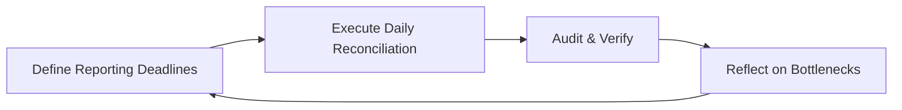
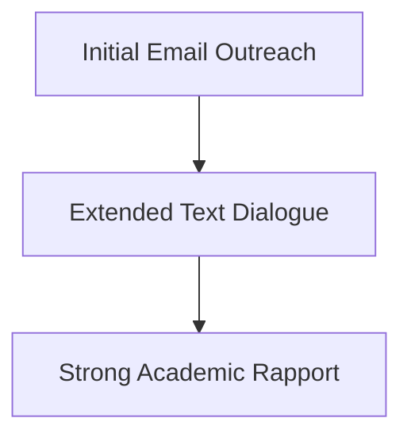

# M.Com Semester 1: Self-Management & Accountability

The financial calendar is relentless. Month-end closes, quarter-end reporting, and tax season will break you if you do not have pristine self-management systems.

---

## 1. Time vs. Energy in High-Stress Periods

During audit season, you cannot simply "work harder." You must work smarter.

*   **Protecting Focus:** Financial modeling requires deep work. You must block out distractions.
*   **Energy Management:** Recognize diminishing returns. An exhausted analyst makes billion-dollar decimal errors.

### The Accountability Loop

---

## 2. Extreme Ownership in Compliance

If a junior analyst makes a data entry error that makes it into the final board report, the manager takes the blame. That is extreme ownership. You own the systems that allowed the error to pass.

---

## Activity: Performance Management Plan

Draft a personal time and energy management plan for high-stress reporting periods.

<!-- PRINT: PG_PerfManagement -->

---

## Executive Interpersonal Skills: Social Information Processing
While early theories believed electronic communication was too "lean" for building strong academic networks, modern research proves otherwise.

*   **Social Information Processing**: We *can* communicate intellectual depth and build rapport online with researchers and industry leaders, it just takes longer without nonverbal cues.

<!-- PRINT_SLIDE -->

