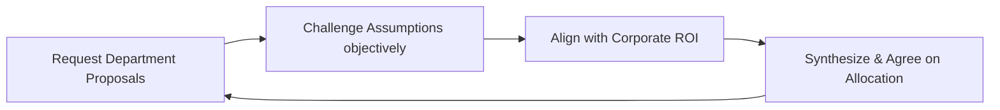
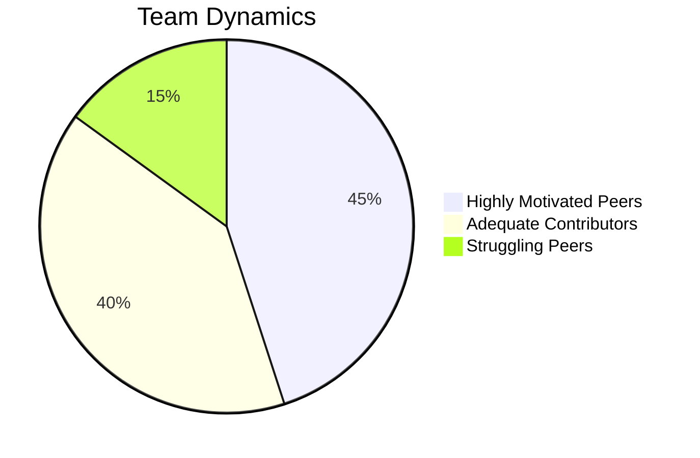

# M.Com Semester 2: Discussion Facilitation

In corporate finance, you will frequently lead cross-functional budget meetings. You will have department heads fighting for limited capital. Your role as facilitator is to guide them toward a budget that aligns with the overall corporate strategy.

---

## 1. The Neutral Financial Guide

A finance facilitator must remain objective. You represent the data and the company's strategic goals, not any single department.
*   **De-escalate:** When sales and marketing argue over budget allocation, redirect them to the ROI metrics.
*   **Synthesize:** "So, Marketing believes $500k will yield a 10% increase in leads, while Sales believes the same amount in headcount will increase close rates by 15%. Let's look at the historical data."

### The Budget Facilitation Loop

---

## Activity: The Facilitated Group Round

Act as the neutral finance facilitator for a 15-minute departmental budget dispute.

<!-- PRINT: PG_Facilitation -->

---

## Executive Interpersonal Skills: Evaluating Collaborative Styles

Future leaders must learn to tailor their approach to different peers during PG projects:
*   **Highly Motivated Peers**: Need frequent, subtle brainstorming sessions to maintain high growth without feeling micromanaged.
*   **Adequate Contributors**: Need clear role definition; they are reliable when given specific tasks.
*   **Struggling Peers**: Need highly frequent, specific guidance tied directly to the project's milestones.

<!-- PRINT_SLIDE -->

