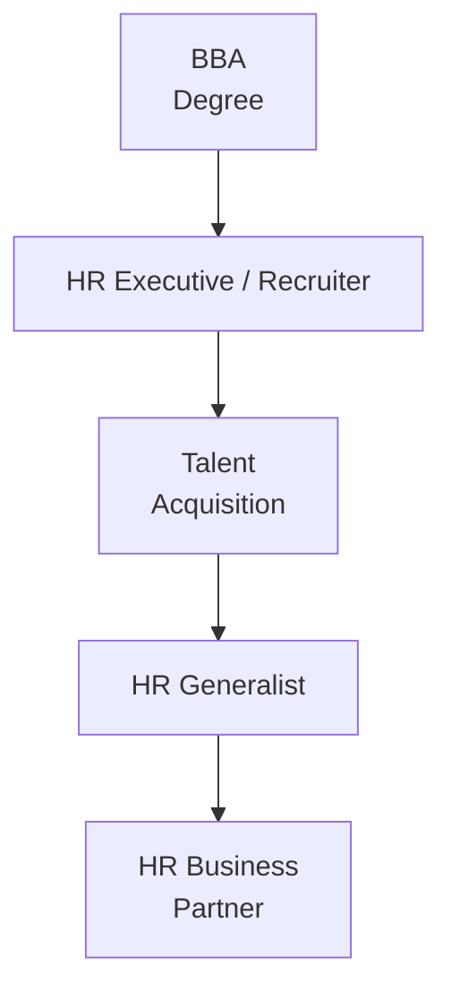
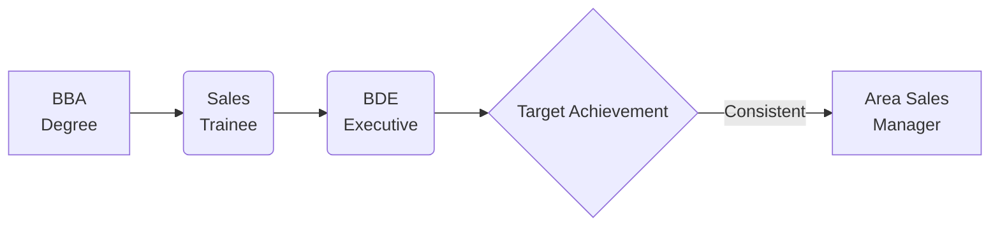
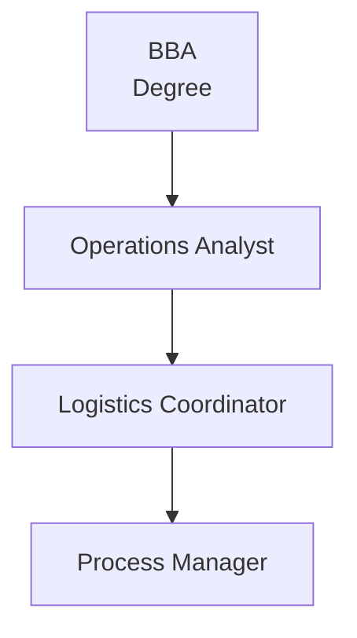

# BBA Semester 5: Traditional Career Paths

Welcome to Semester 5! This semester is about shifting from academic theory to corporate reality. 

For BBA graduates, the traditional career pathways are generally focused on core management functions rather than specialized accounting (like B.Com).

---

## The Core BBA Pathways

1. **Human Resources (HR):** Recruitment, employee relations, payroll, and training.
2. **Marketing & Sales:** Business development, brand management, field sales, and market research.
3. **Operations & Supply Chain:** Logistics, vendor management, quality control, and process optimization.

---

## 1. Human Resources (HR)

The HR route is highly structured and starts with administrative or recruitment roles.

### The HR Roadmap

**Key Skills Required:**
*   Empathy and strong interpersonal communication.
*   Knowledge of basic labor laws and payroll systems.
*   Conflict resolution and negotiation skills.

---

## 2. Marketing & Sales

This is the most common entry point for BBA graduates. It often involves high-pressure targets but offers rapid career growth.

### The Marketing & Sales Roadmap

**Key Skills Required:**
*   High resilience and rejection tolerance.
*   Persuasive communication and presentation skills.
*   Data analysis (for market research roles).

---

## 3. Operations Management

Operations roles are the backbone of e-commerce, manufacturing, and IT services.

### The Operations Roadmap

**Key Skills Required:**
*   Process mapping and analytical thinking.
*   Proficiency in Excel and operational software (e.g., Jira, Asana).
*   Vendor and stakeholder management.

---

## Activity: BBA Career Map

Identify which of the three traditional pillars aligns best with your strengths.

<!-- PRINT: BBATraditionalPaths -->

