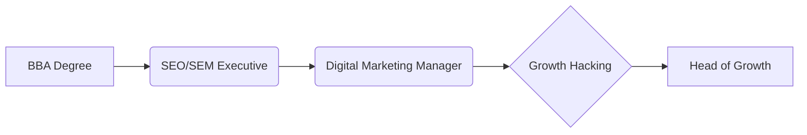
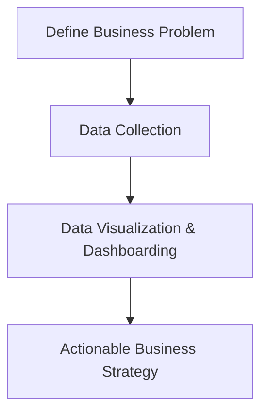

# BBA Semester 5: Modern Career Paths

Last week, we explored the traditional routes of HR, Marketing, and Operations. These paths are proven and structured, but the business landscape is evolving.

This week, we will focus on modern, tech-enabled roles that BBA graduates can transition into, leveraging their foundational business knowledge combined with new digital skills.

---

## The Big Three Modern Paths

1. **Product Management:** Sitting at the intersection of business, technology, and user experience.
2. **Digital Marketing & Growth Hacking:** Data-driven customer acquisition and brand scaling.
3. **Business Analytics:** Using data to drive strategic business decisions.

---

## 1. Product Management

Product managers (PMs) are often called the "CEOs of the product." They don't need to write code, but they need to understand it, and they definitely need to understand business strategy.

### The Product Roadmap
```mermaid
flowchart TD
    A[BBA Degree] --> B[Associate Product Manager (APM)]
    B --> C[Product Manager]
    C --> D[Senior Product Manager]
    D --> E[Director of Product]
```

**Key Skills Required:**
*   Cross-functional leadership (leading without authority).
*   Understanding of Agile methodologies (Scrum/Kanban).
*   User empathy and basic UX design principles.

---

## 2. Digital Marketing & Growth

Modern marketing is highly quantifiable. It's less about billboards and more about CAC (Customer Acquisition Cost) and LTV (Lifetime Value).

### The Growth Roadmap


**Key Skills Required:**
*   Performance marketing (Google Ads, Meta Ads).
*   SEO (Search Engine Optimization) and Content Strategy.
*   A/B testing and conversion rate optimization.

---

## 3. Business Analytics

Companies have more data than ever, but they need people who understand business context to make sense of it.

### The Analytics Workflow


**Roles for BBA Graduates:**
*   **Business Intelligence (BI) Analyst:** Creating dashboards using Tableau or PowerBI.
*   **Data Analyst:** Querying databases to find trends.
*   **Strategy Associate:** Using data to plan market expansions.

---

## Activity: Modern Roles Research

Pick one modern path and identify three companies actively hiring for entry-level positions in that domain.

<!-- PRINT: BBAModernRoles -->
