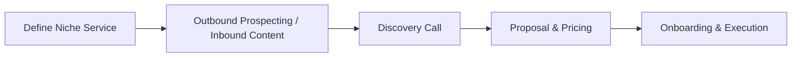
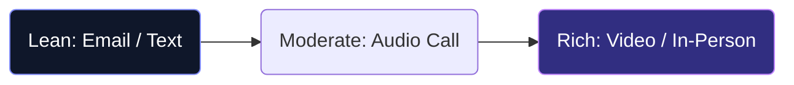

# BBA Semester 5: Freelancing & Consulting

The modern economy is shifting toward gig work and independent consulting. For a BBA graduate, freelancing allows you to build a portfolio of diverse experiences without being tied to a single employer.

---

## The Consulting Mindset

Unlike an employee, a consultant or freelancer is a "business of one." You are not paid for your time; you are paid for the *solutions* you provide.

### The Client Acquisition Funnel

---

## High-Demand Freelance Skills for BBA

You don't need to be a programmer to freelance. Business skills are in high demand:

1. **Virtual Assistant (VA) & Operations:** Managing email, scheduling, and project management tools for busy executives.
2. **Social Media Management:** Creating content calendars, engaging with followers, and running basic ads for local businesses.
3. **Market Research & Lead Generation:** Scraping data, analyzing competitors, and building lists of potential clients for B2B companies.

---

## Building Your Profile

Your Upwork or Fiverr profile is your digital storefront. 

**Key Elements of a Winning Profile:**
*   **A Clear Headline:** Don't write "BBA Graduate." Write "B2B Lead Generation Specialist."
*   **A Professional Photo:** Smiling, good lighting, clean background.
*   **A Portfolio:** Even if they are just mock projects or college assignments that demonstrate your capability.
*   **Client-Centric Bio:** Focus on how you solve *their* problems, not just listing your skills.

---

## Activity: Freelance Profile Draft

Draft the headline and bio for your first freelance profile, focusing on a specific niche.

<!-- PRINT: BBAFreelanceProfile -->

---

## Interpersonal Skills Focus: Media Richness Theory
Not all communication channels are created equal. You must choose the right medium for your message.

*   **Rich Channels** (Office hours, Face-to-face): Best for complex questions about an assignment, emotional discussions, or resolving conflicts with peers.
*   **Lean Channels** (Emails, LMS Messages): Best for routine, unambiguous data transfer (e.g., submitting a paper). 

<!-- PRINT_SLIDE -->

