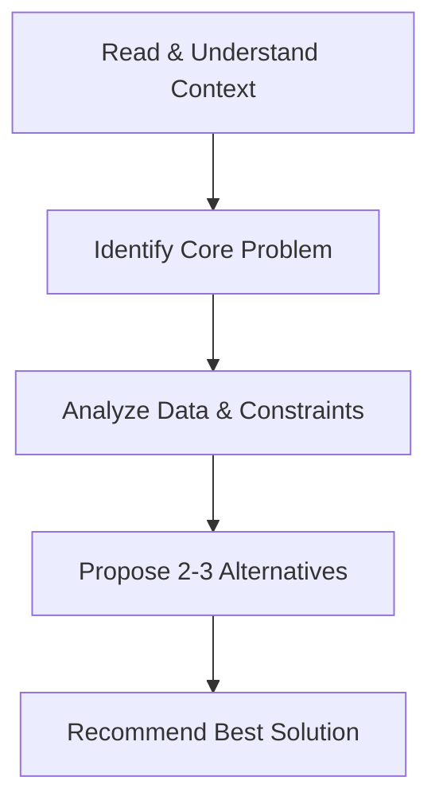

# BBA Semester 5: Industry Case Study

Welcome to the final week of Semester 5! Up until now, you have learned about traditional paths, modern roles, and freelancing. 

This week, we will apply those concepts to a core BBA competency: **Analyzing a Business Case Study**.

---

## What is a Case Study?

A business case study presents a real-world scenario involving a company facing a challenge. Your job is to step into the shoes of a manager, analyze the data, and propose a strategic solution.

### The Case Analysis Framework

---

## Structuring Your Response

When presenting a case study, structure is everything. Use the **STAR** method (Situation, Task, Action, Result) or the **McKinsey MECE** principle (Mutually Exclusive, Collectively Exhaustive) to ensure your points don't overlap and no gaps exist.

1. **Executive Summary:** A 1-minute overview of your entire recommendation.
2. **Analysis:** The "Why" behind the problem.
3. **Strategy:** The "How" you will fix it.
4. **Risks & Mitigation:** What could go wrong with your strategy and how you will handle it.

---

## Case Study: "The Dwindling Coffee Chain"

**Context:** A mid-sized coffee chain is losing market share to premium artisan cafes and cheap fast-food coffee. Their customer base is aging, and their stores look outdated.

**The Task:** As a marketing consultant, you have a limited budget to revitalize the brand. 

*Hint: Do you compete on price, quality, or experience? You cannot pick all three.*

---

## Activity: Case Study Presentation

Prepare a 3-slide presentation outlining your solution for the coffee chain case study.

<!-- PRINT: BBACaseStudy -->
