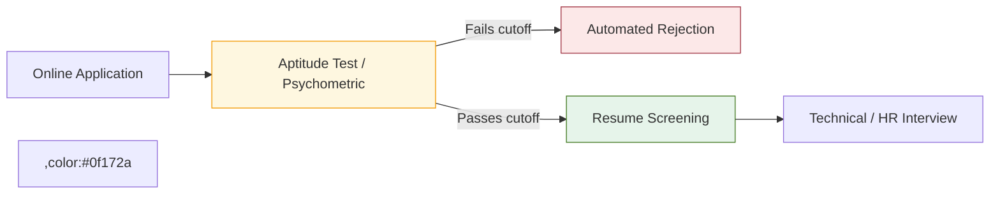

# BBA Semester 6: Psychometric Assessments

Welcome to Semester 6! You are in the final stretch. This semester is entirely dedicated to **Interview Defense and Final Readiness**. We are shifting from learning to *proving*.

Before you even reach the interview stage in most modern companies (especially banks, MNCs, and Big 4 firms), you must pass a **Psychometric Assessment**.

---

## 1. What are Psychometric Assessments?

These are standardized tests designed to measure your cognitive abilities and behavioural style. They are used as a massive filter to eliminate 70-80% of applicants before HR even looks at a resume.

### The Standard Testing Structure

---

## 2. The Three Pillars of Aptitude Tests

Most assessments for commerce graduates are broken down into three timed sections:

| Section | What it Tests | Example Question Types | Strategy |
| :--- | :--- | :--- | :--- |
| **Quantitative Aptitude** | Numerical agility and data interpretation. | Profit/Loss, Ratios, Reading balance sheets/graphs. | Skip questions that require complex calculations. Aim for accuracy over speed. |
| **Logical Reasoning** | Pattern recognition and deduction. | Syllogisms, Seating arrangements, Number series. | Use scratch paper to draw diagrams. Don't do it in your head. |
| **Verbal Ability** | English comprehension and grammar. | Reading comprehension, Error spotting, Synonyms. | Read the questions *before* reading the passage. |

<!-- PRINT_SLIDE -->

---

## 3. The Behavioural / Personality Test

Some companies also include a personality test (e.g., the Myers-Briggs or Big Five). There are technically no "wrong" answers, but companies *are* looking for specific traits.

**What they look for in a BBA hire:**
*   High Attention to Detail (Conscientiousness)
*   Ethical decision-making (Integrity)
*   Ability to work in a team (Agreeableness)

**Pro Tip:** Answer these questions not as how you act on a lazy Sunday, but how you act *at your absolute best in a professional setting*.

---

## Activity: Demo Psychometric Assessment

Today, we will take a timed, 30-minute mock aptitude test. This is designed to be difficult and fast-paced to simulate a real Big 4 assessment.

Use the worksheet below to track your performance and identify your weak spots.

<!-- PRINT: BBAMockAssessment -->

---

## Summary and Next Steps

Aptitude tests are purely about practice. They test speed and pattern recognition, which can only be built through repetition. 

Next week, we will cover **Workplace Tools**—ensuring that the digital files you submit to employers are formatted to corporate standards.

---

## Interpersonal Skills Focus: The Value of Constructive Feedback

The true test of a growing professional is their ability to both deliver and receive critical feedback.
*   **Positive Feedback**: Readily accepted, reinforces your strengths.
*   **Negative Feedback**: Meets high resistance. When evaluating peers, it must be delivered carefully, preferably supported by objective examples from their work.

<!-- PRINT_SLIDE -->

