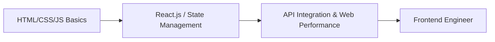
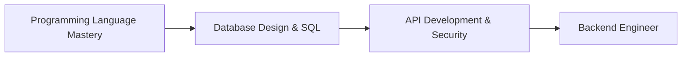

# BCA Semester 5: Software Engineering Pathways

Welcome to Semester 5! You are entering the specialized phase of your BCA degree. The tech industry is vast, and generalist developers are less sought after than those with a clear specialty. 

This week, we explore the core Software Engineering (SWE) pathways: Frontend, Backend, and Full-Stack Development.

---

## 1. Frontend Development

Frontend engineers focus on the user interface and experience. They build what the user sees and interacts with.

**The Tech Stack:**
*   **Core:** HTML, CSS, JavaScript (ES6+)
*   **Frameworks:** React (most popular), Vue, or Angular
*   **Styling:** TailwindCSS, SASS

### The Frontend Roadmap

---

## 2. Backend Development

Backend engineers build the invisible architecture that powers the app: databases, server logic, and APIs.

**The Tech Stack:**
*   **Languages:** Node.js, Python, Java, or Go
*   **Databases:** SQL (PostgreSQL, MySQL) and NoSQL (MongoDB)
*   **Concepts:** REST APIs, GraphQL, Authentication (JWT)

### The Backend Roadmap

---

## 3. Full-Stack Development

A full-stack developer is a "jack of all trades" who can build both the frontend and the backend. They are highly valued in startups.

**The Reality:** Most full-stack developers usually have a strong preference or deep expertise in *either* the front or the back, but can operate competently in both.

---

## Activity: Tech Stack Selection

Analyze your interests and select a primary pathway (Frontend or Backend). Map out the next 3 technologies you need to learn.

<!-- PRINT: BCA_SWEPath -->

---

## Interpersonal Skills Focus: Electronically Mediated Communication (EMC)

We no longer just communicate face-to-face. EMC dominates academia and the modern workplace.
*   **Synchronous vs. Asynchronous**: A video lecture is synchronous. Emails to professors are asynchronous (delayed). The *rate* of your response to internship emails heavily impacts how recruiters perceive you.
*   **Permanence**: Every text, email, and social media post leaves a permanent, discoverable trail. Recruiters *will* google you.

<!-- PRINT_SLIDE -->

