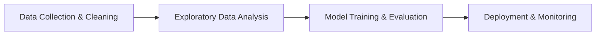

# BCA Semester 5: Data Science & AI

Data is the new oil, and Artificial Intelligence is the engine that runs on it. As a BCA student, transitioning into Data Science or Machine Learning is a highly lucrative pathway.

---

## 1. Data Analytics vs. Data Science

Many students confuse the two. 
*   **Data Analytics** focuses on processing historical data to answer *what* happened and *why*. It relies heavily on SQL, Excel, and visualization tools like Tableau.
*   **Data Science** uses algorithms and predictive modeling to forecast *what will happen next*. It requires strong statistics and programming.

### The Data Science Workflow

---

## 2. Core Technologies for AI/ML

If you want to enter the AI space, Python is non-negotiable.

**The Foundational Stack:**
*   **Language:** Python
*   **Data Manipulation:** Pandas, NumPy
*   **Machine Learning:** Scikit-Learn (for traditional ML), TensorFlow or PyTorch (for Deep Learning)

---

## 3. The Math Prerequisite

You cannot build a career in AI without understanding the underlying math. You don't need a PhD, but you must be comfortable with:
*   **Linear Algebra:** Matrices and vectors (how data is stored).
*   **Calculus:** Gradients and optimization (how AI learns).
*   **Probability & Statistics:** Distributions and significance (how we measure accuracy).

---

## Activity: The Data Pipeline

Outline a data pipeline for a specific business problem (e.g., predicting customer churn).

<!-- PRINT: BCA_DataScience -->

---

## Interpersonal Skills Focus: The Pitfalls of Online Communication

The lack of visual cues makes EMC a breeding ground for misunderstanding.
*   **Writing Style**: Your grammar and syntax in an email to a professor paints a picture of your professionalism. "whaddup? u there?" is not appropriate for college. Use proper salutations (e.g., "Dear Prof. Smith,").

<!-- PRINT_SLIDE -->

