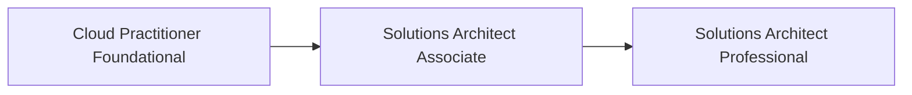
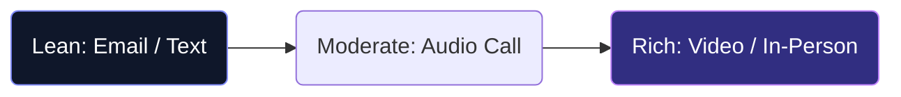

# BCA Semester 5: Cyber & Cloud 

As software eats the world, two critical infrastructures support it: Cloud Computing (where the software lives) and Cybersecurity (how it stays safe).

---

## 1. Cloud Computing (AWS / Azure)

Ten years ago, companies bought physical servers. Today, they rent computing power from Amazon (AWS), Microsoft (Azure), or Google (GCP).

**Core Concepts to Learn:**
*   **Compute:** Virtual machines (EC2) and Serverless computing (Lambda).
*   **Storage:** Object storage (S3).
*   **Networking:** Virtual Private Clouds (VPC) and load balancing.

### The Cloud Certification Route

---

## 2. Cybersecurity & Ethical Hacking

Cybersecurity is not just about hacking into mainframes like in the movies; it is about risk management, patching vulnerabilities, and network monitoring.

**High-Demand Roles:**
*   **Security Analyst (SOC):** Monitoring network traffic for anomalies.
*   **Penetration Tester:** Ethically hacking systems to find weaknesses before the bad guys do.
*   **Cloud Security Engineer:** Ensuring AWS/Azure infrastructure is locked down.

---

## 3. DevOps: The Bridge

DevOps sits between Software Development and IT Operations. It focuses on automating the deployment of code.

**The DevOps Toolkit:**
*   **Containerization:** Docker & Kubernetes.
*   **CI/CD:** GitHub Actions or Jenkins.
*   **Infrastructure as Code:** Terraform.

---

## Activity: Cloud Architecture

Design a basic cloud architecture for a scalable web application.

<!-- PRINT: BCA_CloudArch -->

---

## Interpersonal Skills Focus: Media Richness Theory
Not all communication channels are created equal. You must choose the right medium for your message.

*   **Rich Channels** (Office hours, Face-to-face): Best for complex questions about an assignment, emotional discussions, or resolving conflicts with peers.
*   **Lean Channels** (Emails, LMS Messages): Best for routine, unambiguous data transfer (e.g., submitting a paper). 

<!-- PRINT_SLIDE -->

