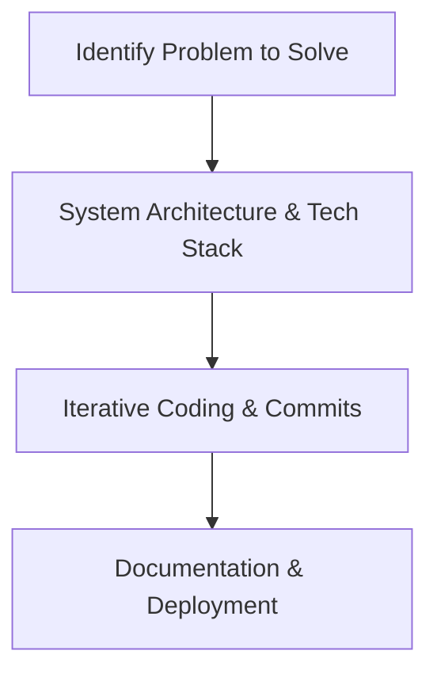

# BCA Semester 5: Tech Portfolio & GitHub

Resumes tell; portfolios *show*. In the tech industry, what you have built matters significantly more than your GPA. 

This week, we focus on building a robust technical portfolio.

---

## 1. The GitHub Profile

Your GitHub profile is your real resume for technical recruiters. 

**What recruiters look for:**
*   **A Solid README:** Your profile should have a well-formatted README introducing who you are and your tech stack.
*   **Green Squares:** Consistent contribution activity shows dedication.
*   **Pinned Repositories:** Pin your top 3-4 projects, ensuring each has a detailed description and a link to a live demo.

### The Project Lifecycle

---

## 2. Choosing Portfolio Projects

Do not build another To-Do app or Calculator. Build projects that demonstrate complex problem-solving.

*   **For Frontend:** A dashboard consuming a live third-party API (e.g., a Crypto price tracker).
*   **For Backend:** A RESTful API with authentication, rate limiting, and a well-designed database schema.
*   **For AI/ML:** A predictive model wrapped in a Flask/FastAPI web interface so users can test it.

---

## 3. Deployment

Code sitting on your laptop is useless. You must deploy it so others can see it.

*   **Frontend Deployment:** Vercel, Netlify, or GitHub Pages.
*   **Backend Deployment:** Render, Heroku, or AWS EC2.
*   **Databases:** MongoDB Atlas or Supabase.

---

## Activity: The Portfolio Audit

Review your current GitHub profile and plan your next portfolio project.

<!-- PRINT: BCA_PortfolioAudit -->
