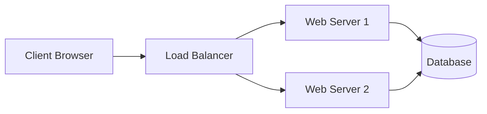

# BCA Semester 6: System Design Basics

If DSA tests how well you write a single function, System Design tests how well you architect an entire application. 

Entry-level roles don't expect you to design Netflix from scratch, but they do expect you to understand the components of a scalable system.

---

## 1. The Monolith vs. Microservices

*   **Monolithic Architecture:** The entire app runs as a single unified unit. Easy to build, hard to scale.
*   **Microservices:** The app is broken down into small, independent services that communicate via APIs. Hard to build, easy to scale.

### A Basic Web Architecture

---

## 2. Key Concepts to Know

1. **Vertical vs. Horizontal Scaling:** Buying a bigger server (Vertical) vs. buying more servers (Horizontal).
2. **Load Balancing:** Distributing traffic across multiple servers so no single server crashes.
3. **Caching:** Storing frequently accessed data in RAM (like Redis) to avoid slow database queries.

---

## 3. The System Design Interview

When asked to design a system (e.g., "Design Twitter"), follow this flow:
1. Clarify requirements (How many users? What features?).
2. Define the APIs.
3. Draw the high-level architecture.
4. Dive deep into the database schema and bottlenecks.

---

## Activity: Design a URL Shortener

Apply basic system design principles to architecture a simple URL shortener like Bitly.

<!-- PRINT: BCA_SystemDesign -->

---

## Interpersonal Skills Focus: Peer Evaluation & Criticism

When providing feedback on a classmate's project, follow these rules:
1.  **Focus on Specific Behaviors**: Don't say "Your part of the presentation was bad." Say "The slides on market analysis needed more recent data."
2.  **Keep it Impersonal**: Criticize the *work*, not the *person*.
3.  **Goal-Oriented**: Feedback should help your peer improve their grade, not just to let you "vent."

<!-- PRINT_SLIDE -->

