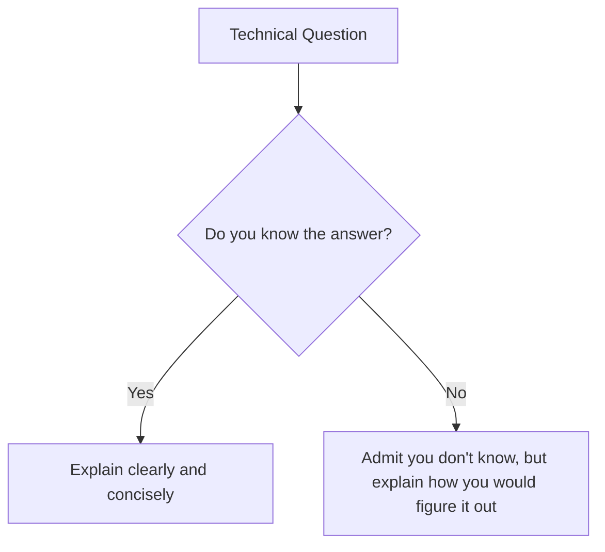

# BCA Semester 6: The Technical Panel Interview

You've passed the coding test and the system design round. Now you are facing a panel of senior engineers. 

They are testing three things: how well you understand the tech stack on your resume, how you handle debugging, and your cultural fit.

---

## 1. Resume Deep Dive

If you listed a technology on your resume, it is fair game. 

*   **Don't List Everything:** If you only used Docker once in a tutorial, do not put it on your resume. If they ask how container networking works and you freeze, it casts doubt on your entire resume.
*   **Be Ready to Explain Why:** "I used MongoDB because it's what the tutorial used" is a bad answer. "I used MongoDB because the data was unstructured and didn't require strict relations" is a good answer.

### The Behavioral Intersection

---

## 2. Live Debugging

Panelists will often hand you a piece of broken code or ask you how you would troubleshoot a bug in production.

**The Debugging Mindset:**
1. Isolate the problem (check the logs).
2. Reproduce the bug locally.
3. Fix the bug.
4. Write a test to ensure it never happens again.

---

## 3. Communication over Code

Senior engineers want to work with someone they can communicate with. A brilliant coder who cannot explain their logic is a liability. 

*Always* communicate your assumptions and constraints.

---

## Activity: The Mock Tech Panel

Practice defending your technical decisions in a simulated panel interview.

<!-- PRINT: BCA_TechPanel -->
