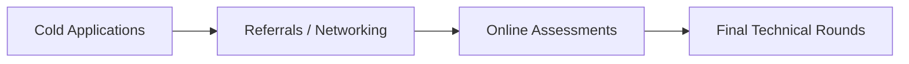

# BCA Semester 6: Capstone Readiness Review

You have reached the end of the BCA curriculum. Over the last 6 semesters, you have built foundational technical skills, soft skills, and interview strategies.

This final week is dedicated to a comprehensive review of your readiness for the tech industry.

---

## 1. The Readiness Checklist

Before you begin applying for roles, ensure your technical foundation is solid:

*   **Portfolio:** Do you have at least 2 non-trivial projects deployed live with clean GitHub repositories?
*   **DSA:** Are you comfortable solving easy/medium algorithmic problems on a whiteboard?
*   **Fundamentals:** Do you have a firm grasp of databases, networking, and basic system design?

### The Job Application Pipeline

---

## 2. Navigating the Tech Job Market

The tech market is competitive. Submitting 500 resumes online is less effective than building a network.

*   **Open Source:** Contribute to open-source projects. It builds your resume and connects you with experienced engineers.
*   **Hackathons:** Participate in hackathons. They force you to build quickly and are great for networking.
*   **Cold Outreach:** Message engineers or recruiters on LinkedIn. Ask for a 15-minute chat about their work, not for a job.

---

## 3. Continuous Learning

Technology changes rapidly. The language or framework you learned in Semester 1 might be outdated by the time you graduate. 

The most important skill you learned was *how to learn*.

---

## Activity: The Final Audit

Complete the capstone readiness checklist and identify your final gaps before placement season begins.

<!-- PRINT: BCA_FinalAudit -->

---

## Interpersonal Skills Focus: Receiving Feedback Gracefully

When you receive constructive criticism from a professor or interviewer (even if it hurts), suppress your ego.
Use *active listening* to understand their perspective. Paraphrase their concerns to ensure you comprehend the root issue, and view it strictly as an opportunity for professional growth. Defensiveness stunts your career before it even begins.

<!-- PRINT_SLIDE -->

