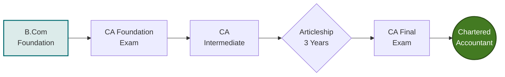
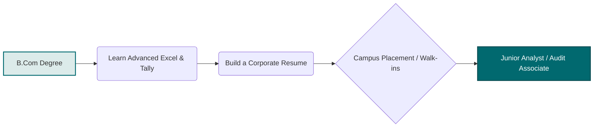
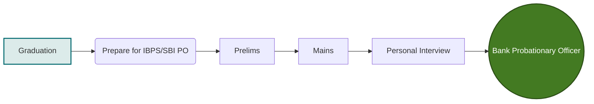

# B.Com Semester 5: Traditional Career Paths

Welcome to Semester 5! As you enter the final year of your B.Com, it is time to transition from general soft skills into **Specialized Career Readiness**. 

This week, we will analyze the most common "Traditional" pathways chosen by B.Com graduates and map out the exact milestones required to succeed in them.

---

## The Big Three Traditional Paths

For decades, the standard progression for a B.Com graduate has fallen into one of three major buckets. While the landscape is changing, these remain highly respected and structured routes:

1.  **Professional Certifications (CA, CS, CMA):** Highly rigorous, exam-oriented pathways leading to certified professional status.
2.  **Corporate Finance & Accounting:** Entry-level roles in MNCs (e.g., Accounts Payable, Junior Analyst, Audit Associate).
3.  **Banking & Public Sector:** Competitive exams (IBPS, SBI PO) for stable, structured career growth in financial institutions.

---

## 1. Professional Certifications (The CA/CS/CMA Route)

If you are pursuing a professional certification, your roadmap is heavily structured around exams and practical training (articleship).

### The CA Roadmap

**Key Skills Required:**
*   Extreme discipline and time management.
*   High resilience to failure.
*   Strong theoretical grasp of taxation and corporate law.

---

## 2. Corporate Finance (The MNC Route)

If you want to enter the corporate sector immediately after graduation, your focus should be on practical tool-based skills rather than just theory.

### The Corporate Entry Roadmap

**Key Skills Required:**
*   Advanced Excel (VLOOKUP, Pivot Tables, Macros).
*   Familiarity with ERP software (SAP, Oracle, Tally).
*   Strong Email and corporate communication skills (which we covered in Semester 4!).

---

## 3. Banking & Public Sector

This route requires clearing highly competitive standardized tests.

### The Banking Roadmap

**Key Skills Required:**
*   Quantitative Aptitude & Logical Reasoning.
*   General and Financial Awareness.
*   Strong interview presence for the final rounds.

---

## Activity: Traditional Career Map

Let's put this into practice. It's time to select one of these paths (even if just as a backup plan) and map out your immediate next steps.

<!-- PRINT: BComTraditionalPaths -->

---

## Summary and Next Steps

Traditional career paths are "traditional" for a reason—they offer stability, prestige, and clear progression. However, they also come with high entry barriers and intense competition.

Next week, we will explore **Modern Career Paths**, where we look at how technology, data, and the digital economy are creating entirely new roles for commerce graduates!

