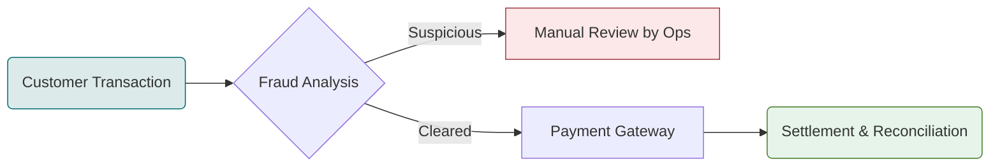
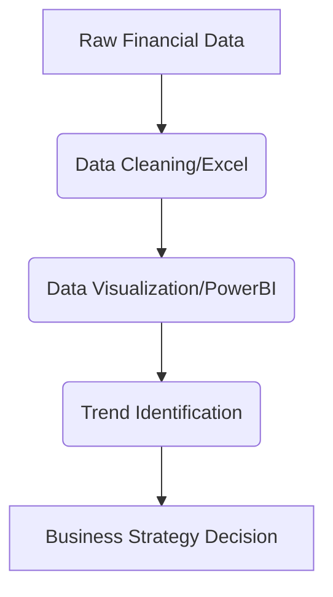

# B.Com Semester 5: Modern Career Paths

Last week, we explored traditional commerce pathways like CA, CS, and Banking. These paths are well-known and highly structured. However, the world of finance and commerce is undergoing a massive transformation driven by technology.

This week, we will explore **Modern Career Paths**—roles that sit at the intersection of finance, data, and digital technology. These roles often did not exist a decade ago but are now among the most lucrative options for a B.Com graduate.

---

## 1. Fintech & Digital Banking

Financial Technology (Fintech) is disrupting traditional banking. Companies like Paytm, Razorpay, and Cred require professionals who understand both finance and technology.

### The Fintech Operations Workflow

**Roles for B.Com Graduates:**
*   **Payment Operations Analyst:** Reconciling failed transactions and ensuring settlements.
*   **Risk & Compliance Associate:** Ensuring the platform complies with RBI regulations (KYC/AML).
*   **Product Analyst:** Working with tech teams to explain how a financial product should behave.

---

## 2. Financial Data Analytics

The era of making financial decisions purely on gut feeling is over. Today, every decision is backed by data.

### The Data Analytics Process

**Why it matters:** 
While traditional accountants record what happened in the past, Data Analysts predict what will happen in the future.

**Skills to Learn:**
*   **Intermediate:** Advanced Excel (PowerQuery).
*   **Advanced:** SQL (for querying databases) and PowerBI / Tableau (for visualization).

---

## 3. Digital Marketing for Finance

Financial products (mutual funds, insurance, credit cards) are notoriously difficult to sell. Companies need marketers who actually understand the financial products they are promoting.

**Roles:**
*   **Performance Marketer:** Running ROI-driven ad campaigns for financial apps.
*   **Financial Content Writer:** Simplifying complex financial concepts (like taxation or SIPs) for blogs and social media.

---

## Activity: Emerging Role Research

Select one modern career path that excites you. Use this worksheet to map out the technical skills you need to learn outside of your standard B.Com syllabus to bridge the gap.

<!-- PRINT: BComModernPaths -->

---

## Summary and Next Steps

The commerce degree is incredibly versatile. By adding just one or two tech-adjacent skills (like Excel, SQL, or digital marketing) to your core financial knowledge, you make yourself exceptionally valuable in the modern job market.

Next week, we will explore the Gig Economy and how to start **Freelancing & Consulting**!

