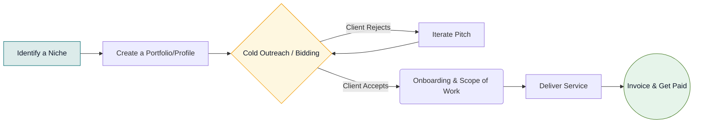
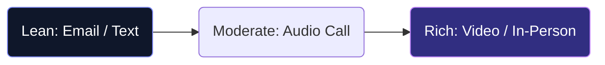

# B.Com Semester 5: Freelancing & Consulting

The modern economy is increasingly shifting toward gig work and independent consulting. For a B.Com graduate, the barriers to entry in freelancing are surprisingly low if you possess specific, high-demand skills.

This week, we will break down how to package your financial knowledge into a service you can sell on platforms like Upwork, Fiverr, or directly to local small businesses.

---

## 1. High-Demand Freelance Skills for B.Com

You don't need a professional certification to start offering basic financial services. Many startups and small businesses simply lack the time to manage their own books.

**Top Freelance Services:**
*   **Virtual Bookkeeping:** Managing day-to-day ledgers using QuickBooks or Xero.
*   **Tax Preparation Support:** Assisting CAs or small firms in filing returns during busy seasons.
*   **Financial Modeling:** Building projected cash-flow statements for startups seeking funding (requires excellent Excel skills).
*   **Financial Content Writing:** Writing blogs for fintech companies or investment firms.

---

## 2. The Client Acquisition Workflow

How do you actually get paid? Unlike a traditional job, freelancing requires you to act as your own marketing and sales department.

### The Freelance Funnel

---

## 3. Setting Up Your Profile

To succeed on platforms like Upwork, your profile must clearly state **what problem you solve**, rather than just listing your degrees.

**Weak Pitch:** "I am a B.Com student looking for data entry or accounting jobs."
**Strong Pitch:** "I help e-commerce startups reconcile their Shopify sales with Xero, ensuring their books are always audit-ready."

---

## Activity: Freelance Profile Draft

Let's assume you want to start a side-hustle this weekend. Use this worksheet to draft your first freelance service offering and bio.

<!-- PRINT: BComFreelance -->

---

## Summary and Next Steps

Freelancing is the ultimate test of your soft skills—you must communicate clearly, manage your own time, and build trust with clients remotely.

Next week, we will put all our theoretical knowledge to the test by analyzing a real-world **Industry Case Study**!

---

## Interpersonal Skills Focus: Media Richness Theory
Not all communication channels are created equal. You must choose the right medium for your message.

*   **Rich Channels** (Office hours, Face-to-face): Best for complex questions about an assignment, emotional discussions, or resolving conflicts with peers.
*   **Lean Channels** (Emails, LMS Messages): Best for routine, unambiguous data transfer (e.g., submitting a paper). 

<!-- PRINT_SLIDE -->

