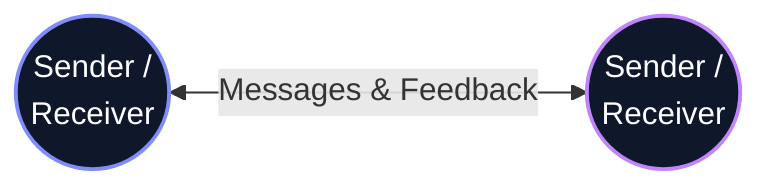

# Welcome to Week 1
## Course Orientation & Self-Awareness


Welcome to college! You are starting a brand new chapter of your life. 

---

# Phase 1: Welcome & Self-Discovery

*   **Superpowers & Secret Fears:** 
    Take out a piece of paper. (Do NOT write your name).
    1. Write down **1 Superpower** (a personal strength: e.g., 'I am a good listener').
    2. Write down **1 Secret Fear** about college or your future career (e.g., 'I freeze on stage').
    
Pass your paper to the aisle. We will read a few out loud. You are not alone!

---

# Phase 2: The Reality Check

**Raise your hand if you think graduating with a degree in three years guarantees you a good job.**

A degree gets your resume looked at. But your communication, your confidence, and your attitude are what actually get you hired. 

My name is **S D Sandarsh**, your Training & Placement Officer, and my job is to make sure you have both.

---

# Phase 3: The Solution — Softskills Studio

This is not a lecture class. This is your **laboratory**. 

You don't get stronger by watching someone else lift weights, and you don't build confidence by watching me talk. 

This is a completely **No-Judgment Zone**. Making a mistake, stuttering, or saying the wrong thing is actively encouraged—because it means you are trying.

---

# Phase 4: The Golden Rules

1. **The Back Row is a Myth:** Participation is non-negotiable. Everyone will speak in this class.
2. **Respect the Effort:** Mistakes are celebrated here. Mocking a classmate who is trying is strictly prohibited. 
3. **Show Up as a Professional:** Treat this studio like your first corporate job.

---

# Moving Forward: Self-Awareness

Now that we know the rules, let's look inward.
The transition from high school to college can feel overwhelming. 

When you understand your own personality and habits, navigating these changes becomes so much easier.

---

# Navigating Your New Environment


Self-awareness helps you right now, today:

* **In the classroom:** Do you learn better by taking detailed notes, or by participating in discussions?
* **In your social life:** Do you recharge by being around large groups, or do you need quiet time alone?
* **Under stress:** How do you react when you have three assignments due on the same day?

---

# The Johari Window: Applied


<!-- PRINT: JohariWindow -->

Let's look at a tool called the Johari Window. Think of it as a mirror for your personality. **Click the Print icon** on the bottom right to get your personal worksheet, and let's fill it out together!

| The Johari Window | Known to Self | Unknown to Self |
| :--- | :--- | :--- |
| **Known to Others** | **OPEN AREA**: Traits you and others both see (e.g., You know you're talkative). | **BLIND SPOT**: Traits others see, but you don't (e.g., You don't realize you interrupt people). |
| **Unknown to Others** | **HIDDEN AREA**: Secrets or fears you keep from others. | **UNKNOWN AREA**: Untapped potential nobody has discovered yet. |

---

# Quadrant 1: The Open Area


Take 2 minutes to reflect independently. 

In the **Open Area** quadrant of your worksheet, write down 3 traits, skills, or behaviors that you confidently project to the world.

*Examples:*
* "I am very organized."
* "I am always the one who talks first."
* "I am a good listener."

---

# Quadrant 2: The Hidden Area


Now, let's look inward. Take 2 minutes for a solo reflection. 

In the **Hidden Area** quadrant, write down 1 personal weakness or fear that you actively try to hide from your classmates or peers. **This stays private.**

*Examples:*
* "I suffer from severe imposter syndrome."
* "I get panic attacks when speaking in public."
* "I am terrified of failing my first exam."

---

# Quadrant 3: The Blind Spot (First Impression Audit)


We are going to do a quick **First Impression Audit** to help you discover a blind spot.

Pair up with someone you don't know well. Follow these exact steps:

1. **Quick Intro:** Introduce yourselves (1 minute).
2. **Give Feedback:** Partner A speaks directly to Partner B using the prompts below.
3. **Receive Feedback:** Partner B writes this feedback into their **Blind Spot** quadrant. You are only allowed to say *"Thank you."* (No defending or explaining!)
4. **Swap Roles.**

| 🗣️ Feedback Prompts for Partner A to answer: |
| :--- |
| **1.** "One positive trait you seem to bring to a team is..." |
| **2.** "My first impression of your communication style is..." |
| **3.** "One thing that makes you seem approachable is..." |

---

# Quadrant 4: The Unknown Area


You might be wondering: *How do I fill out the Unknown Area?*

**You can't.** Not today.

The Unknown Area represents untapped potential, hidden talents, and undiscovered passions. The only way to reveal what's inside that box is to **try new things, take risks, and put yourself in uncomfortable situations** over the next 3 to 4 years of college.

We will revisit this quadrant right before you graduate!

---

# Today's Learning Task


## The Self-Profile Worksheet

<!-- PRINT: SelfProfile -->

Take 15 minutes to complete this worksheet. Don't write what you think the professor wants to read. Write the truth.

| Self-Profile Category | Your Honest Reflection |
| :--- | :--- |
| **Top 3 habits that help you succeed:** | 1. (habit 1), 2. (habit 2), 3. (habit 3) |
| **One habit that consistently derails you:** | |
| **How you plan to manage that bad habit this week:** | |

---

# Evaluation & Next Steps


Please submit the worksheet before the end of the session. We will evaluate it based on the following rubric:

| Criteria | Needs Improvement | Excellent |
| :--- | :--- | :--- |
| **Completeness** | Sections left blank or rushed. | All sections answered thoughtfully. |
| **Insight & Honesty** | Surface-level answers (e.g., "I work too hard"). | Deep, genuine reflection on actual flaws and strengths. |
| **Actionability** | No clear plan for managing bad habits. | Specific, realistic step provided to manage the bad habit. |


---

## Interpersonal Skills Focus: The Communication Process
Communication isn't just speaking; it has evolved into a complex **Transactional Model**:



*   **Action**: A linear transfer of meaning from sender to receiver.
*   **Interaction**: Incorporates feedback and context, becoming a two-way street (e.g., Q&A with your professor).
*   **Transaction**: Simultaneous, concurrent sharing of ideas and feelings. In a group project, you are both sender and receiver at the exact same time.

<!-- PRINT_SLIDE -->


---
```absurd-abstract
image: https://res.cloudinary.com/l4eozknq/image/upload/v1790259237/o55xnd3m9xs9bcwp2673.jpg
question: What is going on in this image?
reveal: It is just a test image!
```
