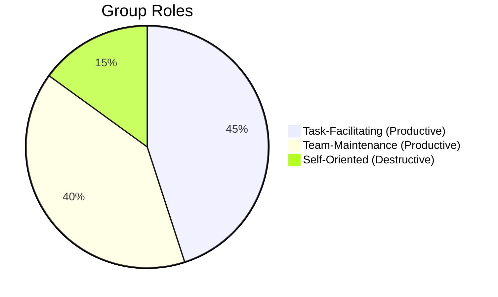

# Welcome to Semester 3: Week 10
## Writing Skills II

Last week, we focused on the building blocks of professional writing. This week, we will apply those skills to the two most important documents in your early career: your Resume and your Professional Email.

---

# The Resume

Your resume is your professional snapshot. It is not an autobiography; it is a marketing document designed to get you an interview.

*   **Structure:** Keep it to one page. Use clean, readable fonts and distinct sections (Education, Skills, Experience, Projects).
*   **Action Verbs:** Start bullet points with strong action verbs (e.g., "Led," "Developed," "Analyzed").
*   **Results:** Whenever possible, quantify your achievements (e.g., "Increased sales by 15%," not "Helped increase sales").

---

# The Professional Email

Emails are the primary mode of workplace communication. Every email you send builds (or diminishes) your professional reputation.

*   **Subject Line:** Make it clear and actionable (e.g., "Request for Review: Project Proposal").
*   **Greeting & Sign-off:** Always include a professional greeting ("Dear Ms. Smith," "Hi Team,") and sign-off ("Best regards," "Sincerely,").
*   **The BLUF Principle:** Bottom Line Up Front. State the purpose of the email in the very first sentence.

---

# Activity: Resume and Email Draft

<!-- PRINT: WritingSkills2 -->

Let's put this into practice.

1.  **Resume Draft:** Use the provided worksheet to draft your "Skills" and "Education" sections following the principles of clarity and action verbs.
2.  **Email Draft:** Write an email to a hypothetical manager requesting 2 days of leave, applying the BLUF principle.
3.  **Peer Review:** Exchange your drafts with a partner and provide constructive feedback.

---

# Evaluation Rubric

You will be evaluated this week on:

*   **Format:** Are the documents structured cleanly and professionally?
*   **Accuracy:** Are they free of spelling and grammar errors?
*   **Professionalism:** Does the email strike the appropriate professional tone?

---

## Interpersonal Skills Focus: Navigating Group Dynamics
Every student in a group project naturally assumes a role. Which one are you?

*   **Task-Facilitating Roles**: Initiating research, coordinating schedules, setting deadlines.
*   **Team-Maintenance Roles**: Encouraging peers, harmonizing disagreements, compromising.
*   **Self-Oriented Roles**: Controlling the entire project, withdrawing (freeloading), or seeking attention.

<!-- PRINT_SLIDE -->

